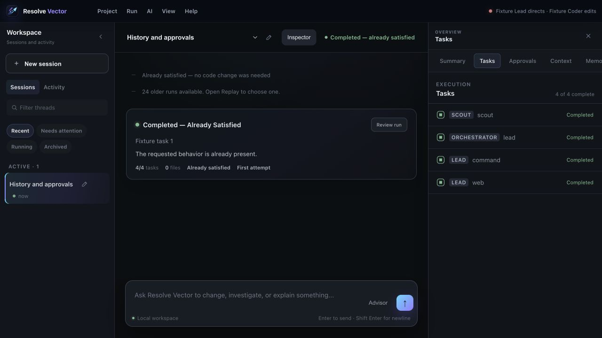

# Resolve Vector

> From intent to working code.

Resolve Vector is a native macOS workbench for inspectable AI-assisted coding. It keeps plans, live activity, model routing, approvals, evidence, and project memory visible while work is running.

## Download

Resolve Vector is preparing its first public release. Installers, checksums, and release notes will appear on the [Releases](../../releases) page.

Only download Resolve Vector from this repository or [resolvevector.com](https://resolvevector.com).

## Highlights

- A native macOS application instead of a browser-shaped developer tool.
- Visible live progress, task state, decisions, and completion evidence.
- Bring-your-own provider credentials or compatible local models.
- Explicit approval for commands, web access, and sensitive changes.
- Project-scoped memory that can be reviewed, corrected, or removed.
- Inspectable routing so you can see which model is directing and editing.
- Local-first project state and credential storage.

## Requirements

- Apple silicon Mac.
- macOS 13 or newer.
- A supported AI provider account, or a compatible local model server.

## Start here

- [Install Resolve Vector](docs/INSTALLATION.md)
- [First run and provider setup](docs/GETTING_STARTED.md)
- [Privacy and local data](docs/PRIVACY.md)
- [Troubleshooting](docs/TROUBLESHOOTING.md)
- [Verify a downloaded release](docs/VERIFY_DOWNLOADS.md)
- [Documentation index](docs/README.md)
- [Get support](SUPPORT.md)
- [Report a security issue](SECURITY.md)

## About this repository

This is the official public distribution and documentation repository. It contains packaged releases, checksums, release notes, public documentation, and issue tracking.

Application source code and private development history are not published here.

Copyright 2026 Resolve Vector. All rights reserved.
