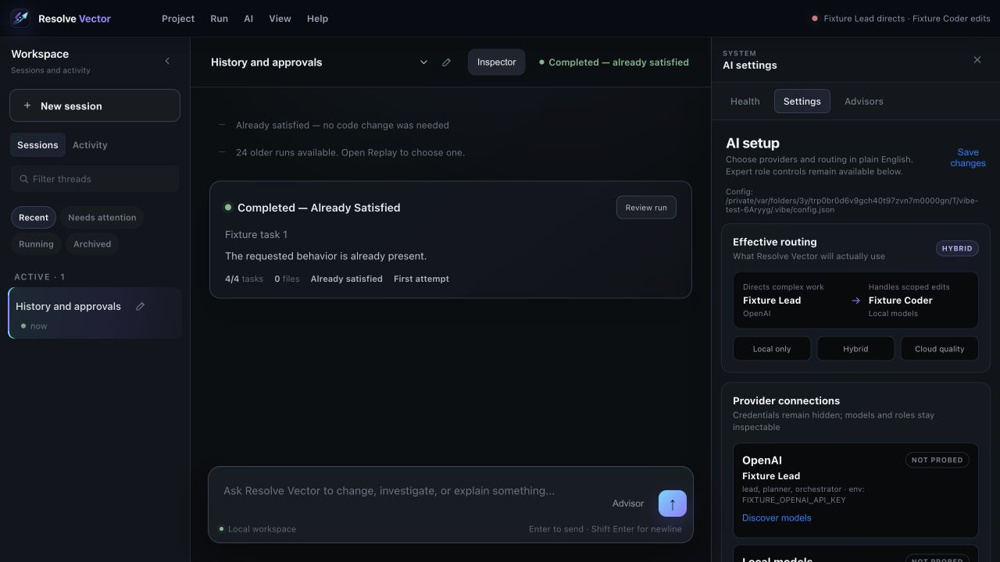

# Getting Started

## 1. Choose a project

Open Resolve Vector and select the folder containing the project you want it to work on. Resolve Vector remembers the selection for later launches.

Each project's settings, history, memory, and credentials are isolated under that project's `.vibe` directory.

## 2. Configure an AI provider

Open **Resolve Vector → Settings** or **AI → Models and Routing**.

You can use:

- a supported cloud provider with your own API key;
- an OpenAI-compatible provider;
- a compatible local model server.

For cloud providers, prefer the protected local secrets option. Resolve Vector writes the raw key to `.vibe/secrets.json` with owner-only permissions and adds that file to `.vibe/.gitignore`. Normal configuration stores only the secret's name.

Never paste an API key into a task, advisor request, report, or ordinary configuration field.

## 3. Confirm routing

The Settings inspector shows the effective lead and coding models. Use provider health checks before starting important work.

## 4. Create a session

Create a session for a clear goal, describe the work in the composer, and send it. Resolve Vector displays progress in the main workspace and keeps technical detail available in Activity.

## 5. Review approvals and evidence

Resolve Vector pauses when an action needs your authorization. Read the exact command, URL, or change before approving it. When work completes, use the inspector to review tasks, changes, evidence, and run history.

The complete searchable guide is available inside the application under **Help → Resolve Vector Help**.
